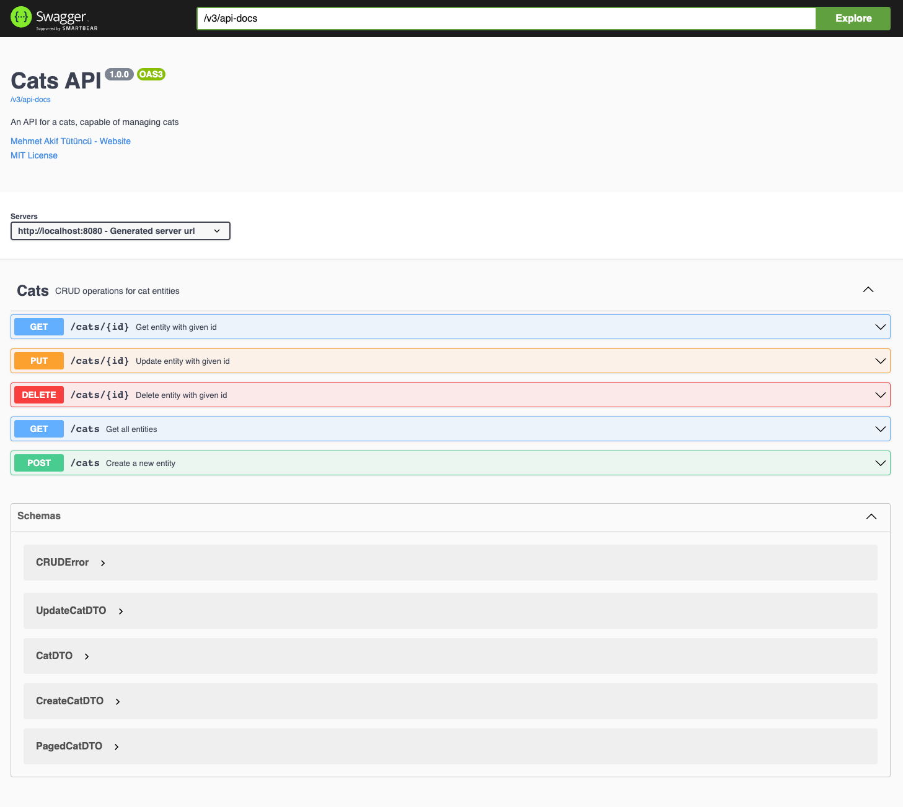

# spring-boot-crud-api

This is the API module of spring-boot-crud. It brings support for classes to build CRUD applications with out-of-the-box functionality. See [Contents](#contents) section for details of each class it provides.

## Table of Contents

1. [Getting Started](#getting-started)
2. [Contents](#contents)
3. [Variants](#variants)
4. [Extending the Domain](#extending-the-domain)

## Getting Started

To get started, add spring-boot-crud-api as a dependency to your existing project. In case you are building something from scratch, you can generate a project with typical dependencies needed for a CRUD application using [Spring Initialzr](https://start.spring.io/#!dependencies=web,data-jpa,flyway,postgresql,validation).

For Gradle with Kotlin DSL, add following to `build.gradle.kts`:

```kotlin
dependencies {
  implementation('dev.akif:spring-boot-crud-api:0.5.0')
}
```
For Gradle, add following to `build.gradle`:

```kotlin
dependencies {
  implementation 'dev.akif:spring-boot-crud-api:0.5.0'
}
```
For Maven, add following to your `pom.xml`:

```xml
<dependencies>
  <dependency>
    <groupId>dev.akif</groupId>
    <artifactId>spring-boot-crud-api</artifactId>
    <version>0.5.0</version>
  </dependency>
</dependencies>
```

## Contents

One strength of spring-boot-crud is that it enables you to avoid most of the boilerplate of writing a CRUD application and instead put your focus on your data models.

For the remainder of this document, let's assume we're building an CRUD application with APIs about cats. Let's also assume we'll write the application with Spring Boot 3 in Kotlin, use PostgreSQL for storage, have ids of type `UUID`, and that a cat has following properties:

* a `name` of type `String`
* a `breed` of type `String`
* an `age` of type `Int`

Based on this domain, writing a CRUD application using spring-boot-crud-api, we can follow these steps.

### 1. Data Models

Our database table under these assumptions could look like this:

```sql
CREATE TABLE cats(
    id         UUID PRIMARY KEY,
    version    INTEGER                  NOT NULL DEFAULT 0,
    created_at TIMESTAMP WITH TIME ZONE NOT NULL DEFAULT NOW(),
    updated_at TIMESTAMP WITH TIME ZONE NOT NULL DEFAULT NOW(),
    deleted_at TIMESTAMP WITH TIME ZONE          DEFAULT NULL,
    name       TEXT                     NOT NULL,
    breed      TEXT                     NOT NULL,
    age        INTEGER                  NOT NULL,
    -- We have a composite unique index of "name + breed + age" to define a unique cat.
    -- Including "deleted_at" in the constraint lets us do soft-deletion.
    UNIQUE NULLS NOT DISTINCT (name, breed, age, deleted_at)
);
```

#### 1.1. [CRUDEntity](src/main/kotlin/dev/akif/crud/CRUDEntity.kt)

We need an entity type to match our database table to use at the persistence layer. This type needs to extend `CRUDEntity` and could be implemented as:

```kotlin
import dev.akif.crud.*
import jakarta.persistence.*
import java.lang.UUID

@Entity
@Table(name = "cats")
class CatEntity(
    @Id override var id: UUID?,
    var name: String?,
    var breed: String?,
    var age: Int?,
    override var version: Int?,
    override var createdAt: Instant?,
    override var updatedAt: Instant?,
    override var deletedAt: Instant?
): CRUDEntity<UUID>() {
    override fun toString(): String =
        "CatEntity(id=$id, name=$name, breed=$breed, age=$age, version=$version, createdAt=$createdAt, updatedAt=$updatedAt, deletedAt=$deletedAt)"
}
```

Please note:

* We need at least `@Entity` annotation to be compatible with JPA.
* spring-boot-crud-api enforces to have `id`, `version`, `createdAt`, `updatedAt` and `deletedAt` fields.
* All fields need to be nullable `var`s to be compatible with JPA.
* Having a `toString` helps in logging and debugging.
* We **cannot** use a data class for our entity.

#### 1.2. [CRUDModel](src/main/kotlin/dev/akif/crud/CRUDModel.kt)

Next, we can define our data model for the business layer. It needs to extend `CRUDModel` and could be implemented as:

```kotlin
import dev.akif.crud.*
import java.util.UUID

data class Cat(
    val id: UUID,
    val name: String,
    val breed: String,
    val age: Int,
    val version: Int,
    val createdAt: Instant,
    val updatedAt: Instant,
    val deletedAt: Instant?
): CRUDModel<UUID> {
    override fun id(): UUID = id
    override fun version(): Int = version
    override fun createdAt(): Instant = createdAt
    override fun updatedAt(): Instant = updatedAt
    override fun deletedAt(): Instant? = deletedAt
}
```

Please note:

* We should use a **data class**.
* The library also supports Java clients so to support records in Java implementations. That's why it defines `id()`, `version()`, `createdAt()`, `updatedAt()` and `deletedAt()` methods (so in Java, the model can be defined using records in a similar way to Kotlin's data classes). Java records would implement them automatically, but they need to be overridden in Kotlin.
* `deletedAt` is **nullable** because for non-deleted data, it will be `null`.

##### 1.2.1. [CRUDCreateModel](src/main/kotlin/dev/akif/crud/CRUDCreateModel.kt)

To be able to create a new cat, we need some necessary data. In the current domain, that would be the `name`, `breed` and `age` of a cat. This can be represented as a create model which needs to extend `CRUDCreateModel`. It can be implemented as:

```kotlin
import dev.akif.crud.*

data class CreateCat(val name: String, val breed: String, val age: Int): CRUDCreateModel
```

##### 1.2.2. [CRUDUpdateModel](src/main/kotlin/dev/akif/crud/CRUDUpdateModel.kt)

Similar to create models, we can have update models that contain the **updateable** properties of a cat. In this case, a cat's `name` and `age` can change but it doesn't make sense to make its `breed` updateable. This should extend `CRUDUpdateModel` and can be implemented as:

```kotlin
import dev.akif.crud.*

data class UpdateCat(val name: String, val age: Int): CRUDUpdateModel
```

#### 1.3. [CRUDDTO](src/main/kotlin/dev/akif/crud/CRUDDTO.kt)

Next, we can define our DTO types to model the data our API will expose at HTTP layer. It needs to extend `CRUDDTO` and could be implemented as:

```kotlin
import dev.akif.crud.*
import java.lang.UUID

data class CatDTO(
    val id: UUID,
    val name: String,
    val breed: String,
    val age: Int,
    val createdAt: Instant,
    val updatedAt: Instant
): CRUDDTO<UUID> {
    override fun id(): UUID = id
    override fun createdAt(): Instant = createdAt
    override fun updatedAt(): Instant = updatedAt
}
```

Please note:

* We should use a **data class**.
* Similar to `CRUDModel`, `id()`, `createdAt()` and `updatedAt()` methods need to be overridden for Java compatibility.
* There is no `version` or `deletedAt` because they don't need to be exposed from the API as they are implementation details of our application.

##### 1.3.1. [CRUDCreateDTO](src/main/kotlin/dev/akif/crud/CRUDCreateDTO.kt)

Similar to a create model, we can have a create DTO that we require as a payload in our create endpoint. It needs to extend `CRUDCreateDTO` and can be implemented as:

```kotlin
import dev.akif.crud.*

data class CreateCatDTO(val name: String, val breed: String, val age: Int): CRUDCreateDTO
```

##### 1.3.2. [CRUDUpdateDTO](src/main/kotlin/dev/akif/crud/CRUDUpdateDTO.kt)

Similar to a update model, we can have an update DTO that we require as a payload in our update endpoint. It needs to extend `CRUDUpdateDTO` and can be implemented as:

```kotlin
import dev.akif.crud.*

data class UpdateCatDTO(val name: String, val age: Int): CRUDUpdateDTO
```

### 2. Mappers

So far, we defined our data models but we also need ways to convert between them. Let's now define these.

#### 2.1. [CRUDMapper](src/main/kotlin/dev/akif/crud/CRUDMapper.kt)

In order to be able to convert between concrete types of an entity and model, we need a mapper which extends `CRUDMapper`. It can be implemented as:

```kotlin
import dev.akif.crud.*
import org.springframework.stereotype.*
import java.util.UUID

@Component
class CatMapper: CRUDMapper<UUID, CatEntity, Cat, CreateCat, UpdateCat> {
    override fun entityToBeCreatedFrom(createModel: CreateCat, now: Instant): CatEntity =
        CatEntity(
            id = UUID.randomUUID(),
            name = createModel.name,
            breed = createModel.breed,
            age = createModel.age,
            version = 0,
            createdAt = now,
            updatedAt = now,
            deletedAt = null
        )

    override fun entityToModel(entity: CatEntity): Cat =
        Cat(
            id = requireNotNull(entity.id) { "id is required." },
            name = requireNotNull(entity.name) { "name is required." },
            breed = requireNotNull(entity.breed) { "breed is required." },
            age = requireNotNull(entity.age) { "age is required." },
            version = requireNotNull(entity.version) { "version is required." },
            createdAt = requireNotNull(entity.createdAt) { "createdAt is required." },
            updatedAt = requireNotNull(entity.updatedAt) { "updatedAt is required." },
            deletedAt = entity.deletedAt
        )

    override fun updateEntityWith(entity: CatEntity, updateModel: UpdateCat) {
        entity.apply {
            name = updateModel.name
            age = updateModel.age
        }
    }
}
```

Please note:

* It needs `@Component` to be discoverable by Spring Boot.
* In `entityToBeCreatedFrom`, we fill in the properties we know from a create model and we use default initial values for the other properties in order to set all fields of our entity. This involves giving the entity an id as well. Picking `UUID` as our id type let us create this without the need for a DB query. For other id types, we would set the value to `null` and it would be set by Hibernate later by a separate DB operation.
* In `entityToModel`, we would need to convert from nullable values to non-nullable values. Using Kotlin's non-null assertion `!!` is possible but being a little more explicit by having `requireNotNull` calls is more helpful.
* `updateEntityWith` is a side-effectful method to update data of given entity from given update model. Only update properties that exist in update model because the rest of required updates are taken care of by the library.

#### 2.2. [CRUDDTOMapper](src/main/kotlin/dev/akif/crud/CRUDDTOMapper.kt)

Similar to mapper, in order to be able to convert between concrete types of a model and a DTO, we need a mapper which extends `CRUDDTOMapper`. It can be a separate component be implemented as:

```kotlin
import dev.akif.crud.*
import org.springframework.stereotype.*
import java.util.UUID

@Component
class CatDTOMapper: CRUDDTOMapper<UUID, Cat, CatDTO, CreateCat, UpdateCat, CreateCatDTO, UpdateCatDTO> {
    override fun createDTOToCreateModel(createDTO: CreateCatDTO, parameters: Parameters): CreateCat =
        CreateCat(
            name = createDTO.name,
            breed = createDTO.breed,
            age = createDTO.age
        )

    override fun modelToDTO(model: Cat, parameters: Parameters): CatDTO =
        CatDTO(
            id = model.id,
            name = model.name,
            breed = model.breed,
            age = model.age,
            createdAt = model.createdAt,
            updatedAt = model.updatedAt
        )

    override fun updateDTOToUpdateModel(updateDTO: UpdateCatDTO, parameters: Parameters): UpdateCat =
        UpdateCat(
            name = updateDTO.name,
            age = updateDTO.age
        )
}
```

It may also be preferable to have the same mapper type extend both `CRUDMapper` and `CRUDDTOMapper` for simplicity but for now let's write each component separately.

Please note:

* [Parameters](../api/src/main/kotlin/dev/akif/crud/common/Parameters.kt) is a container type that has path and query parameters extracted from the HTTP request. It is provided in the DTO mapper so you can use such values during the conversions.

### 3. Repositories

Now that we have data models and we know how to convert between them, it's time to create components of our CRUD application to, sort of, glue these together. The first one is the persistence layer.

#### 3.1. [CRUDRepository](src/main/kotlin/dev/akif/crud/CRUDRepository.kt)

In order to communicate with the DB, we need a repository. This needs to extend `CRUDRepository` and can be implemented as:

```kotlin
import dev.akif.crud.*
import org.springframework.stereotype.*
import java.util.UUID

@Repository
interface CatRepository: CRUDRepository<UUID, CatEntity>
```

This repository extends from `JpaRepository` and brings the abilities to do:

| Description                                                                             | Method                                         | SQL Equivalent                                                                                                                                                                                                             |
|-----------------------------------------------------------------------------------------|------------------------------------------------|----------------------------------------------------------------------------------------------------------------------------------------------------------------------------------------------------------------------------|
| Find all cats with pagination                                                           | `findAllByDeletedAtIsNull(pageable: Pageable)` | `SELECT * FROM cats WHERE deleted_at = NULL LIMIT {limit} OFFSET {offset}`                                                                                                                                                 |
| Find one cat by its id                                                                  | `findByIdAndDeletedAtIsNull(id: UUID)`         | `SELECT * FROM cats WHERE id = {id} AND deleted_at = NULL`                                                                                                                                                                 |
| Create a new cat                                                                        | `save(cat: Cat)`                               | `INSERT INTO cats(id, version, created_at, updated_at, deleted_at, name, breed, age) VALUES({id}, {version}, {created_at}, {updated_at}, {deleted_at}, {name}, {breed}, {age})`                                            |
| Update a cat using optimistic locking (also used for deletion a cat with soft-deletion) | `update(cat: Cat)`                             | `UPDATE cats SET id = {id}, version = {version + 1}, created_at = {created_at}, updated_at = {updated_at}, deleted_at = {deleted_at}, name = {name}, breed = {breed}, age = {age} WHERE id = {id} AND version = {version}` |

Please note that it needs `@Repository` to be discoverable by Spring Boot.

### 4. Services

With the data models, mappers and a repository, we have some abilities already. However, for a REST API, we also need services to deal with business logic.

#### 4.1. [CRUDService](src/main/kotlin/dev/akif/crud/CRUDService.kt)

For our business layer, we need a service class that extends `CRUDService`. It can be implemented as:

```kotlin
import dev.akif.crud.*
import org.springframework.stereotype.*
import java.util.UUID

@Service
class CatService(
    instantProvider: InstantProvider,
    repository: CatRepository,
    mapper: CatMapper
): CRUDService<UUID, CatEntity, Cat, CreateCat, UpdateCat, CatRepository, CatMapper>(
    typeName = "Cat",
    instantProvider = instantProvider,
    repository = repository,
    mapper = mapper
) {
    override fun createUsingRepository(entity: CatEntity, parameters: Parameters): CatEntity =
        repository.save(entity)

    override fun getUsingRepository(id: UUID, parameters: Parameters): CatEntity? =
        repository.findByIdAndDeletedAtIsNull(id)

    override fun listUsingRepository(pageable: Pageable, parameters: Parameters): Page<CatEntity> =
        repository.findAllByDeletedAtIsNull(pageable)

    override fun updateUsingRepository(entity: CatEntity, parameters: Parameters): Int =
        repository.update(entity)
}
```

Please note:

* It needs `@Service` to be discoverable by Spring Boot.
* `typeName` here is used in logs. It should be a constant String describing your entity so singular type name `Cat` is a good choice.
* `*UsingRepository` methods are there to let you customize the interaction with repositories. This is especially useful if you need to extract and use values from provided `Parameters` or when you have custom methods in your repositories that you'd like to call.

### 5. Controllers

The (almost) last piece of our CRUD puzzle is the end-of-the-world part of our REST API, which is our web controllers.

#### 5.1. [CRUDController](src/main/kotlin/dev/akif/crud/CRUDController.kt)

In order to expose endpoints in our HTTP or web layer, we need a controller and some request mapping. This should extend `CRUDController` and can be implemented as:

```kotlin
import dev.akif.crud.*
import org.springframework.web.bind.annotation.*
import java.util.UUID

@RestController
@RequestMapping("/cats")
class CatController(
    service: CatService,
    mapper: CatDTOMapper
): CRUDController<UUID, CatEntity, Cat, CatDTO, CreateCat, UpdateCat, CreateCatDTO, UpdateCatDTO, CatMapper, CatDTOMapper, CatRepository, CatService>(
    typeName = "Cat",
    service = service,
    mapper = mapper
)
```
This will bring the implementations of following endpoints.

| HTTP Method | URI Path                              | Input                                                                                                                                                | Output                                                                                                                                                                                                                  |
|-------------|---------------------------------------|------------------------------------------------------------------------------------------------------------------------------------------------------|-------------------------------------------------------------------------------------------------------------------------------------------------------------------------------------------------------------------------|
| `POST`      | `/cats`                               | A `CreateCatDTO` as Json payload in request body                                                                                                     | <ul><li>`201 Created` with `CatDTO` when successful</li><li>`409 Conflict` with `CRUDError` when a cat with given data already exists</li></ul>                                                                         |
| `GET`       | `/cats?page={page}&perPage={perPage}` | <ul><li>`page` query parameter for the requested page number</li><li>`perPage` query parameter for the number of items requested in a page</li></ul> | `200 Ok` with `Paged<CatDTO>` with the requested page of cats                                                                                                                                                           |
| `GET`       | `/cats/{id}`                          | `id` of the cat as a path parameter                                                                                                                  | <ul><li>`200 Ok` with `CatDTO` when successful</li><li>`404 Not Found` with `CRUDError` when cat with given id is not found</li></ul>                                                                                   |
| `PUT`       | `/cats/{id}`                          | <ul><li>`id` of the cat as a path parameter</li><li>A `UpdateCatDTO` as Json payload in request body</li></ul>                                       | <ul><li>`200 Ok` with `CatDTO` when successful</li><li>`404 Not Found` with `CRUDError` when cat with given id is not found</li><li>`409 Conflict` with `CRUDError` when a cat with given data already exists</li></ul> |
| `DELETE`    | `/cats/{id}`                          | `id` of the cat as a path parameter                                                                                                                  | `204 No Content` with no body                                                                                                                                                                                           |

Here [CRUDError](src/main/kotlin/dev/akif/crud/error/CRUDError.kt) type is the error model and [Paged](src/main/kotlin/dev/akif/crud/common/Paged.kt) type is the wrapper model for paged data.

Please note:

* It needs `@RestController` to be discoverable by Spring Boot, also making the default codec Json for endpoint methods.
* It needs `@RequestMapping` to bind these endpoints to a URI path. To follow REST principles, it's a good idea to make this path the lower-kebab-cased plural name of our entity, in this case it's `/cats`.
* `typeName` here is used in logs, the same idea as of `CRUDService`.

### 6. Finishing Touches

We almost completed our CRUD application making use of spring-boot-crud-api. There are only 2 things remaining to do to make everything work properly.

#### 6.1. [InstantProvider](src/main/kotlin/dev/akif/crud/common/InstantProvider.kt)

If you check again, our `CatService` requires an `InstantProvider` instance as a dependency. This is required to get the current `java.time.Instant` for dealing with `createdAt`, `updatedAt` and `deletedAt` fields. In order to make this replaceable in tests, there is an additional abstraction. In your application, you'll need a `@Bean` definition of `InstantProvider` otherwise your application wouldn't start.

Luckily, there are already builder methods to get an instance. Easiest way to define this bean would be to define a method in your application class/file.

```kotlin
import dev.akif.crud.common.InstantProvider
import org.springframework.boot.autoconfigure.SpringBootApplication
import org.springframework.boot.runApplication
import org.springframework.context.annotation.Bean

@SpringBootApplication
class Main {
    @Bean
    fun instantProvider(): InstantProvider = InstantProvider.utc
}

fun main(args: Array<String>) {
    runApplication<Main>(*args)
}

```

Here, `InstantProvider.utc` builds an `InstantProvider` that uses a `java.time.Clock.systemUTC()` to get current `java.time.Instant` which is a good default for your application.

#### 6.2. [CRUDErrorHandler](src/main/kotlin/dev/akif/crud/error/CRUDErrorHandler.kt)

By now the application should be able to run. However, in order to handle API errors and to satisfy the documented contract, we need a `@RestControllerAdvice` defined for the application.

Again, there is an existing implementation and the easiest way to define this is to define it in the starting point of your application by extending it with `CRUDErrorHandler`. We can update the `Main` definition above as:

```kotlin
import dev.akif.crud.common.InstantProvider
import dev.akif.crud.error.CRUDErrorHandler
import org.springframework.boot.autoconfigure.SpringBootApplication
import org.springframework.boot.runApplication
import org.springframework.context.annotation.Bean
import org.springframework.web.bind.annotation.RestControllerAdvice

@RestControllerAdvice
@SpringBootApplication
class Main: CRUDErrorHandler {
    @Bean
    fun instantProvider(): InstantProvider = InstantProvider.utc
}

fun main(args: Array<String>) {
    runApplication<Main>(*args)
}
```

Now the errors of your application will conform to `CRUDError` schema.

### 7. Bonus: OpenAPI Documentation with Swagger UI

All this work has a nice bonus. You get properly documented OpenAPI documentation of your API with a Swagger UI to browse and test. After making sure your project contains `org.springdoc:springdoc-openapi-starter-webmvc-ui` as a dependency, you will be able to access this.

Let's make some small additional customizations first. Update your `Main` as:

```kotlin
import dev.akif.crud.common.InstantProvider
import dev.akif.crud.error.CRUDErrorHandler
import io.swagger.v3.oas.annotations.OpenAPIDefinition
import io.swagger.v3.oas.annotations.info.*
import org.springframework.boot.autoconfigure.SpringBootApplication
import org.springframework.boot.runApplication
import org.springframework.context.annotation.Bean
import org.springframework.web.bind.annotation.RestControllerAdvice

@OpenAPIDefinition(
    info = Info(
        title = "Cats API",
        version = "1.0.0",
        description = "An API for a cats, capable of managing cats",
        contact = Contact(name = "Mehmet Akif Tütüncü", url = "https://akif.dev"),
        license = License(
            name = "MIT License",
            url = "https://opensource.org/licenses/MIT"
        )
    )
)
@RestControllerAdvice
@SpringBootApplication
class Main: CRUDErrorHandler {
    @Bean
    fun instantProvider(): InstantProvider = InstantProvider.utc
}

fun main(args: Array<String>) {
    runApplication<Main>(*args)
}
```

and your `CatController` as:

```kotlin
import dev.akif.crud.*
import dev.akif.crud.common.InstantProvider
import io.swagger.v3.oas.annotations.tags.Tag
import org.springframework.web.bind.annotation.RequestMapping
import org.springframework.web.bind.annotation.RestController
import java.util.UUID

@RestController
@RequestMapping("/cats")
@Tag(name = "Cats", description = "CRUD operations for cat entities")
class CatController(service: CatService, mapper: CatDTOMapper): CRUDController<UUID, CatEntity, Cat, CatDTO, CreateCat, UpdateCat, CreateCatDTO, UpdateCatDTO, CatMapper, CatDTOMapper, CatRepository, CatService>(
    typeName = "Cat",
    service = service,
    mapper = mapper
)
```

The default configuration of Swagger UI is at `/swagger-ui.html` so if you navigate to that after running your application, you should have access to your generated API documentation.



## Variants

In cases where you don't need all the flexibility explained above, spring-boot-crud-api also provides some variants. Since these variants simplify the abstractions, they require fewer type parameters, which may make them more useful in particular cases.

### 1. [Simple](src/main/kotlin/dev/akif/crud/simple)

This is a variant of CRUD where there is no distinction between a model and its create/update components. The same idea also applies to DTOs. This would imply following:

* There is one DTO type and it extends `SimpleDTO`. This means it is in-turn extending a `CRUDDTO`, a `CRUDCreateDTO` and a `CRUDUpdateDTO`.
* There is one model type and it extends `SimpleModel`. This means it is in-turn extending a `CRUDModel`, a `CRUDCreateModel` and a `CRUDUpdateModel`.

All other `CRUD*` components follow `Simple*` naming.

### 2. [Simpler](src/main/kotlin/dev/akif/crud/simpler)

This is a variant that takes `Simple` a step further and removes the distinction between a DTO and a model. This would imply following:

* There is one model type and it extends `SimplerModel`. This means it is in-turn extending a `CRUDModel`, a `CRUDCreateModel`, a `CRUDUpdateModel`, a `CRUDDTO`, a `CRUDCreateDTO` and a `CRUDUpdateDTO`.

All other `CRUD*` components follow `Simpler*` naming.

### 3. [Simplest](src/main/kotlin/dev/akif/crud/simplest)

This is a variant that takes `Simpler` a step further and removes the model as well. The only component describing your data would be the entity. This would imply following:

* There is only the entity type and it extends `SimplestEntity`. This means it is in-turn extending a `CRUDEntity`, a `CRUDModel`, a `CRUDCreateModel`, a `CRUDUpdateModel`, a `CRUDDTO`, a `CRUDCreateDTO` and a `CRUDUpdateDTO`.

All other `CRUD*` components follow `Simplest*` naming.

The simplest variant is not recommended for a real-world application as it would lead to exposing your implementation and persistence details to the outside world via your entity type.

## Extending the Domain

So far, the Cat API we built is limited. As the problem domain grows, we are required to add more components. If we decide that "cats can have toys", we would still be able to utilize spring-boot-crud, but it would require some more customizations in order to get the same set of features.

You can find a complete Cat API that supports toys in [kotlin-spring-boot-template](https://github.com/makiftutuncu/kotlin-spring-boot-template) repository.
